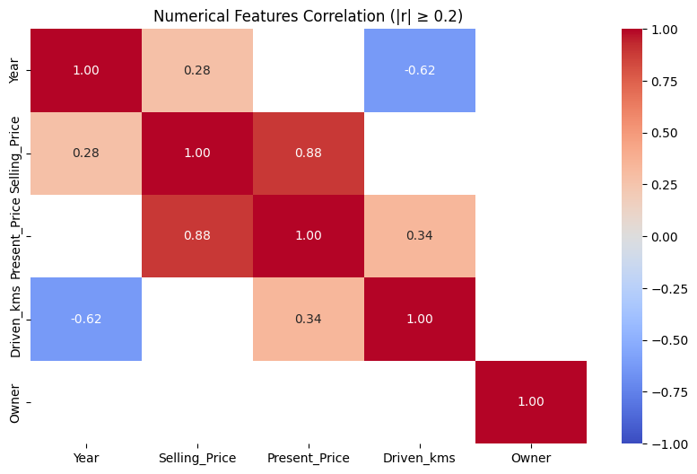

# ML_MINI_3TEAM

# **프로젝트 명 : 중고차 가격 예측 모델 개발** 🚗

## 💡**팀명**

### DBalance

조용한 팀원들과 활발한 에너지의 조합으로 만들어낸 ‘데시벨 밸런스’,
그리고 다양한 DB에서 균형 잡힌 인사이트를 도출하겠다는 의미를 담았습니다.
 

## 🌟 **팀원 소개**  

| 이름      | GitHub ID                           |
|-----------|------------------------------------|
| 🧑‍💻 최동현  | [@donghyun4957](https://github.com/donghyun4957) |
| 👩‍💻 김수현  | [@K-SH98](https://github.com/K-SH98)         |
| 👩‍💻 김세한  | [@kimsehan11](https://github.com/kimsehan11) |
| 👨‍💻 성기혁  | [@venus241004](https://github.com/venus241004) |
| 👨‍💻 임길진  | [@LGJ0405](https://github.com/LGJ0405) |

 

## 🛠️ **기술 스택**

| **분류**   | **기술/도구**                                                                                       |
| **분류**         | **기술/도구**                                                                            |
|------------------|------------------------------------------------------------------------------------------|
| **언어**         |      |
| **라이브러리**   |               |
| **협업 툴**      |    |

 

## 1. 프로젝트 개요

### 1.1 프로젝트 주제 선정 배경

중고차 시장은 해마다 성장하고 있으며, 차량의 연식, 주행거리, 연료 유형, 브랜드, 모델 등 다양한 요인이 차량 가격에 복합적으로 작용합니다. 하지만 일반 소비자 입장에서는 이러한 요인 각각이 가격에 미치는 영향을 직관적으로 이해하거나 정량적으로 판단하기 어렵습니다. 이에 따라 중고차 거래 과정에서는 정보의 비대칭이 발생하고, 이는 구매자와 판매자 모두에게 불리한 의사결정으로 이어질 수 있습니다.

본 프로젝트는 다음과 같은 가설을 전제로 시작되었습니다:

"중고차 가격은 차량의 연식, 주행거리, 연료 종류, 브랜드 등 주요 특성에 따라 예측 가능하며, 이러한 변수들은 가격 결정에 통계적으로 유의미한 영향을 미친다."

이 가설을 바탕으로, 데이터를 수집하고 정제한 뒤 머신러닝 기반 회귀 모델을 통해 중고차 가격에 영향을 주는 요인을 분석하고자 합니다. 단순한 가격 예측을 넘어서, 어떤 요인이 얼마나 영향을 주는지를 파악함으로써 시장 참여자들에게 실질적인 통찰을 제공하는 것이 목표입니다.

이 프로젝트는 다음과 같은 동기에서 출발하였습니다:

- **데이터 기반 의사결정**: 경험과 감에 의존한 중고차 가격 책정이 아닌, 데이터를 기반으로 한 합리적인 기준 제시

- **실생활과의 높은 연관성**: 실제 거래가 이뤄지는 시장 데이터를 분석함으로써 실용성과 적용 가능성 확보

- **회귀 문제로서의 적절성**: 다양한 수치형 및 범주형 변수를 포함하고 있어, 다변량 회귀 분석의 전형적인 사례로 활용 가능

또한, 매일경제 보도에 따르면 중고차 판매자가 게시한 평균 가격은 약 748만 원이지만, 실제 구매 가격은 평균 2,129만 원으로 약 2.8배의 차이를 보이고 있습니다. 이러한 가격 차이는 투명하고 근거 기반의 가격 산정 시스템의 필요성을 더욱 부각시키며, 본 프로젝트의 실효성을 뒷받침합니다. [출처](https://www.mk.co.kr/news/business/10203008)

 

### 1.2 프로젝트 목적
본 프로젝트의 목적은 다음과 같습니다:

- 모델 개발 및 비교: 다양한 머신러닝 회귀 모델을 활용하여 예측 성능을 비교하고, 가장 효과적인 모델을 도출

- 시장 참여자 지원: 중고차 구매자와 판매자 모두가 활용할 수 있는 가격 예측 기준을 제시하여, 시장의 투명성과 효율성을 향상

 

## 2. 데이터 선택 및 구조

### 2.1 데이터 선택
본 프로젝트에서는 차량의 연식, 주행거리, 연료 타입, 모델 등의 정보를 포함하고 있으며, 실거래 가격(label)까지 명시된 중고차 데이터셋을 선택.

- **다양한 차량 특성 반영**: 데이터셋에는 가격 결정에 영향을 줄 수 있는 다양한 변수(연식, 연료 종류, 변속기, 주행거리, 차량 모델 등)가 포함되어 있어, 가격에 영향을 미치는 요인을 종합적으로 분석 가능.

- **회귀 모델 학습에 적합한 구조**: 다수의 연속형 및 범주형 변수가 혼합된 형태로 구성되어 있어, 다양한 회귀 알고리즘을 실험하고 비교하기에 적합한 구조를 갖춤.

**데이터 출처**

 

### 2.2. 데이터 구조

#### **분석 타겟 컬럼**
- `Selling_Price` : 중고차 실거래가 (예측 대상)

#### **주요 변수**
- `Car_Name` : 모델명
- `Year` : 차량 출시 연도
- `Driven_kms` : 차량 누적 주행 거리
- `Fuel_Type` : 연료 종류 (가솔린, 디젤, CNG 등)
- `Transmission` : 변속기 종류 (수동, 자동)
- `Present_Price` : 중고차 시장가(시세)
- `Selling_type` : 판매자 유형 (딜러, 개인)
- `Owner` : 차량을 거친 소유자 수

 

## 3. 데이터 기초 통계량

| 항목  | Year | Selling Price | Present Price | Driven KMs | Owner |
|-------|------|----------------------------|----------------------------|------------|--------------|
| Count | 301  | 301                        | 301                        | 301        | 301          |
| Mean  | 2013.6 | 4.7                      | 7.6                        | 36,947.2   | 0.04         |
| Std   | 2.9   | 5.1                       | 8.6                        | 38,886.9   | 0.25         |
| Min   | 2003  | 0.1                       | 0.3                        | 500        | 0            |
| 25%   | 2012  | 0.9                       | 1.2                        | 15,000     | 0            |
| 50%   | 2014  | 3.6                       | 6.4                        | 32,000     | 0            |
| 75%   | 2016  | 6.0                       | 9.9                        | 48,767     | 0            |
| Max   | 2018  | 35.0                      | 92.6                       | 500,000    | 3            |

 

## 4. 데이터 전처리 및 EDA (탐색적 데이터 분석)

- 이상치 제거, 파생변수 생성, 필요한 변수 추출(drop)

### 4.1 데이터 조회

수치형, 범주형 데이터 확인

데이터 결측치 조회

    - 데이터 결측치 처리:

        | 컬럼명         | 결측치 개수 |
        |---------------|:-----------:|
        | price         |      0      |
        | year          |      0      |
        | mileage       |      0      |
        | fuel          |      0      |
        | brand         |      0      |
        | model         |      0      |
        | transmission  |      0      |
        | engine_size   |      0      |
        | color         |      0      |

        > `df.isnull().sum()` 결과, 결측값이 없어 별도 처리는 하지 않음

수치형 데이터 이상치 조회

- 주행거리와 구매가격 분포에서 일부 샘플이 전체 데이터와 비교해 비정상적으로 큰 값을 가져 통계적으로 이상치로 판단.
- 해당 이상치들은 전체 차량 시장의 일반적인 경향을 반영하지 않으며, 오히려 모델 성능을 왜곡할 우려가 있음.
- 모델이 더 일반적인 패턴을 안정적으로 학습할 수 있도록 주행거리와 구매가격 분포에서 이상치 제거.

 
수치형, 범주형 변수 조회

### 4-2. 그래프 시각화

#### 판매 가격에 따른 수량 막대그래프

#### 수치형 변수들과 판매 가격 산점도

- 차량 연식을 자동차 나이로 계산한 파생변수 생성

#### 연료 유형에 따른 판매 가격 분포

#### 변속기 유형에 따른 판매 가격 분포

#### 판매 유형에 따른 판매 가격 분포

#### 차량 모델별 판매량

#### Top 10 판매 차량 모델별 가격 분포

- Top 10 판매차량 모델 및 그 외 범주로 구성된 파생변수 생성

#### 수치형 변수들 간의 상관관계 히트맵

#### 수치형 변수들 간의 강한 상관관계 히트맵(|r|>=0.2)

#### 주행거리와 판매가와의 상관관계 고찰

 

### 5. 머신러닝 파이프라인

#### - 학습에 사용된 변수

  

- Target : `Selling_Price`

#### - 변수 전처리 과정

  

- 수치형 변수 : StandardScaler 적용   
- 범주형 변수 : LabelEncoder 적용

#### - 테스트 모델 및 하이퍼파라미터 후보군

  

- Linear Regression : 선형 회귀  
- Ridge Regression : 릿지 회귀 (L2 정규화)  
- Lasso Regression : 라쏘 회귀 (L1 정규화)  
- Decision Tree : 결정 트리 회귀  
- Random Forest : 랜덤 포레스트 회귀  
- Gradient Boosting : 그래디언트 부스팅 회귀  
- SVR : 서포트 벡터 회귀  
- KNN : K-최근접 이웃 회귀  
- XGBoost : eXtreme Gradient Boosting 회귀  

각 모델별로 다양한 하이퍼파라미터 후보군을 설정하여 성능을 비교함

#### - 최종 변수 결과

  

  

#### - 교차 검증 결과

  

- scoring은 neg_mean_squared_error를 사용함
- 최적의 변수 조합과 모델 선정, 교차검증 결과를 통해 최종 성능 평가
- 교차검증 시 실제 스케일에 대한 평가가 결여되어 모델의 일반화 성능 확인 부족

 

## 6. 최종 인사이트 및 정책적 제언

#### 상관 관계
- Present_Price – Selling_Price
	- Present_Price(시장가)가 높을 수록 Selling_Price(실거래가) 역시 높게 형성 됨.

- Year - Selling_Price
	- Year(연식)이 최근일수록 Selling_Price(실거래가)가 높아지는 경향이 보임.
	- 그러나 Car_Name_Grouped(차종), Driven_kms(주행거리) 등 다양한 변수가 많아 단일 변수로는 영향이 미미함.

- Driven_kms - Present_Price
	- Driven_kms(주행거리)가 많을수록 Present_Price(시장가)가 높아지는 경향이 보이긴 함.
	- 그래프를 확인하면 대부분의 차량이 10만 km 이하에 몰려 있고, 이 구간에서도 차량 별 판매가가 넓게 분포되어 있어
    주행거리와 시장가 간엔 상관관계가 매우 약함.
  - 하지만 차량 모델에 따른 주행거리와 시장가 간의 관계를 분석했을 때 대부분의 모델들이 주행거리에 따라 시장가가   감소하는 추세를 보임.

#### 정책적 시사점
   1. 투명한 가격 산정을 위한 가이드라인 제공  
   2. 차량 품질 인증 및 관리 시스템 구축으로 소비자 보호 및 시장 효율성 제고
   3. 데이터 기반 중고차 거래 플랫폼 활성화

 

### 7. 한계점

1. **데이터의 한계**

   - 데이터가 오래된 경우 연식 변수의 중요도가 시점에 따라 달라질 수 있음. 예를 들어, 2020년 데이터에서의 2018년식 차량과 2025년 데이터에서의 2018년식 차량은 시장에서 서로 다른 가치를 가질 수 있음. 

   - 데이터의 지역적 편중, 브랜드별 불균형 등도 존재하여 실제 시장 전체를 대표하기에는 한계가 있음.

2. **변수 선택의 한계**
   - 본 모델은 연식, 주행거리 등 주요 변수 위주로 분석을 진행하였으나, 실제 중고차 가격에는 소비자 선호도, 지역, 계절, 경제 상황, 유행 등 다양한 요인이 복합적으로 작용함. 이러한 변수들이 데이터에 포함되지 않아 예측 모델의 설명력과 현실 적용력이 제한됨.

   - 예를 들어, 특정 지역에서는 같은 연식·주행거리 차량이라도 가격 차이가 발생할 수 있고, 계절에 따라 SUV나 오픈카 등 특정 차종의 수요가 달라질 수 있음. 이러한 요인들이 반영되지 않아 모델의 예측 결과가 실제 시장과 다를 수 있음.

3. **실제 적용의 한계**
   - 본 모델은 실제 중고차 거래 플랫폼에 바로 적용하기 위해서는 추가적인 검증과 보완이 필요함. 예측 결과가 실제 거래 가격과 차이가 있을 수 있으며, 시장 데이터와의 연동, 사용자 피드백 반영, 지속적인 모델 업데이트 등에 대한 보완이 필요함.

4. **데이터셋 한계에 대한 근거**
    - 브랜드 평판, 온라인 리뷰가 구매자 선호에 결정적인 역할을 함을 보여주는 논문
    -  https://www.itm-conferences.org/articles/itmconf/pdf/2025/01/itmconf_dai2024_04033.pdf 

 

🌈 **팀원 한 줄 회고**
<table>
  <tr>
    <th style="width:80px;">이름</th>
    <th>회고 내용</th>
  </tr>
  <tr>
    <td>최동현</td>
    <td>물론 적절한 주제를 잡는 것이 가장 어려웠고 가장 시간이 많이 소요되었지만 데이터 분석 결과를 해석하고 거기서 더 나아가 학습 성능 향상을 위한 분석까지 해야하는 것들도 많이 어려웠습니다. 관계가 있을 것이라고 생각한 변수들이 관계가 없어서 원인 찾는 데에도, 학습을 진행하는 과정에서 진행한 전처리가 결과 값 오차를 계산하기 위해 역변환을 해줘야한다는 디테일 등 다양한 크고 작은 것들을 하나하나 다 신경써가면서 하려다 보니 완성도 높은 결과물을 만들기가 조금 힘들었습니다.</td>
  </tr>
  <tr>
    <td>김세한</td>
    <td>협업 중 코드 버전 관리와 충돌 해결이 가장 어려웠음. Git의 브랜치 전략을 도입하고, 커밋 메시지 규칙을 정해 팀원 간 소통을 강화함으로써 효율적으로 협업할 수 있었음. 또한 다양한 머신러닝 모델을 적용하며 데이터 전처리와 하이퍼파라미터 튜닝의 중요성을 체감함.</td>
  </tr>
  <tr>
    <td>김수현</td>
    <td>주제 정하는 것부터 어느 하나 쉬운일이 없었지만, 팀원들과 함께 머리 맞대고 해결해 나가면서 끝까지 완성할 수 있었어요! EDA는 조금 아쉬웠지만, 짧은 시간 안에 머신러닝을 직접 경험해볼 수 있어서 정말 뜻깊은 시간이었습니다.</td>
  </tr>
  <tr>
    <td>성기혁</td>
    <td>처음엔 입력 데이터의 대부분이 범주형 데이터인 것을 깊이 고려하지 않고 ML 프로젝트를 진행했지만, 조언을 통해 머신러닝을 적용할 필요조차 없는 문제였다는 걸 인식하게 되었고, ‘중고차 가격 예측’으로 주제를 변경하며, 데이터 특성에 따라 적절한 방법론을 선택하는 안목이 필요하다는 걸 배웠다.</td>
  </tr>
  <tr>
    <td>임길진</td>
    <td>머신러닝 프로젝트를 하면서 주제 선정에 가장 어려움을 느꼇습니다. 무언가 주제를 선정해도 해당 주제가 머신러닝이 필요한게 맞나, 또는 머신러닝 영역에서 가능한가를 제대로 확인하지 않고 진행해 주제가 부적합한것을 나중에나 알게 되어 판을 갈아 엎는일이 발생해 충분한 데이터 수집이나 검증이 부족해 아쉬움이 남았습니다.</td>
  </tr>
</table>
